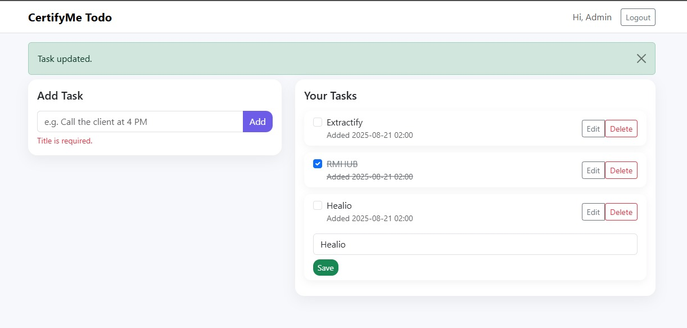

# CertifyMe – User Authentication + Todo List (Flask)

A secure Flask web app where users can register, log in, reset passwords, and manage a personal todo list. Built with SQLAlchemy on SQLite, Bootstrap 5 UI, and production‑ready Docker packaging. CI runs tests on every push. Deployed on Render.

**Live demo:** [https://certifyme-todo-task.onrender.com](https://certifyme-todo-task.onrender.com)

---

## Features

* **Auth**

  * Register with name, email, password (unique email enforced)
  * Login/Logout (session-based)
  * Forgot / Reset password (simple email lookup + reset form)
  * Passwords hashed (Werkzeug / Flask built-ins)
* **Todo**

  * Create, list, delete tasks (scoped to the logged-in user)
  * Inline **edit** and **mark done/undone**
* **UI**

  * Responsive Bootstrap 5 layout, modern components, flash messages
* **App**

  * WSGI via **Gunicorn**
  * Dockerized (least-privilege user, deterministic runtime)
  * Works locally with `docker compose` or plain Python
  * Tests with **pytest**
  * CI/CD ready (GitHub Actions + Render)

---

## Tech Stack

| Layer       | Tech                                 |
| ----------- | ------------------------------------ |
| Backend     | Python 3.11, Flask                   |
| Database    | SQLite (SQLAlchemy ORM)              |
| Frontend    | HTML5, Jinja templates               |
| Styling     | Bootstrap 5 (CDN)                    |
| WSGI Server | Gunicorn                             |
| Packaging   | Docker + docker compose              |
| CI          | GitHub Actions (`.github/workflows`) |
| Hosting     | Render (Docker deploy)               |

---

## Repository Structure

```
.
├─ .github/workflows/
│  ├─ docker.yml         # build/publish/checks (optional)
│  └─ tests.yml          # run pytest on push/PR
├─ static/
│  └─ tick_todo.jpg      # favicon / branding asset
├─ templates/
│  ├─ base.html
│  ├─ dashboard.html
│  ├─ forgot_password.html
│  ├─ login.html
│  ├─ register.html
│  └─ reset_password.html
├─ tests/                # pytest tests
├─ .dockerignore
├─ .editorconfig
├─ .gitignore
├─ .prettierrc.json
├─ Dockerfile
├─ README.md
├─ app.py                # Flask app factory & routes
├─ docker-compose.yml
├─ entrypoint.sh         # drops root & launches gunicorn
├─ models.py             # SQLAlchemy models & init_db
├─ package.json          # (dev tooling/formatting)
├─ package-lock.json
├─ pyproject.toml        # code style config
├─ pytest.ini
├─ requirements.txt
├─ requirements-dev.txt
└─ wsgi.py               # `app = create_app()` for gunicorn
```

> **Note:** The runtime database file for local Docker lives at `/app/data/db.sqlite3` inside the container. In compose, it’s persisted via a named volume.

---

## Quick Start

### Option A — Run with Docker (recommended)

1. Create a minimal **`.env`** in the repo root (kept out of git by `.gitignore`):

   ```env
   # Local Docker defaults
   SECRET_KEY=change-this-in-production
   DATABASE_URL=sqlite:////app/data/db.sqlite3
   ```

2. Build & run:

   ```bash
   docker compose up --build -d
   # then open http://localhost:8000
   ```

3. Logs & stop:

   ```bash
   docker compose logs -f web
   docker compose down
   ```

> Verify the DB inside the container:
> `docker compose exec web sh -lc "ls -la /app/data"`

---

### Option B — Run locally (Python)

1. Python 3.11+ & pip. Then:

   ```bash
   python -m venv .venv
   # Windows PowerShell
   . .venv/Scripts/Activate.ps1
   pip install -r requirements.txt
   ```

2. Create **`.env`**:

   ```env
   SECRET_KEY=change-this-in-production
   DATABASE_URL=sqlite:///db.sqlite3       # local file in repo folder
   ```

3. Start the server:

   ```bash
   # Windows PowerShell
   $env:FLASK_ENV = "development"
   python app.py
   # or: gunicorn -w 1 -b 0.0.0.0:8000 wsgi:app
   ```

4. Open [http://localhost:8000](http://localhost:8000)

---

## Environment Variables

| Variable       | Required | Default (local)                       | Notes                                          |
| -------------- | -------- | ------------------------------------- | ---------------------------------------------- |
| `SECRET_KEY`   | Yes      | —                                     | Flask session/CSRF secret. **Keep safe**       |
| `DATABASE_URL` | Yes      | `sqlite:///db.sqlite3` (local Python) | Use `sqlite:////app/data/db.sqlite3` in Docker |

SQLite URLs use **3 slashes** for a relative path (local), **4 slashes** for absolute paths (Docker container).

---

## Tests

Run tests **inside Docker**:

```bash
docker compose exec web sh -lc "PYTHONPATH=/app python -m pytest -q"
```

Or **locally**:

```bash
pytest -q
```

> Current suite covers auth flows and todo CRUD; all tests should pass.

---

## Routes (high level)

* `GET /` → redirect to `/dashboard` (if logged in) or `/login`
* `GET|POST /register` → create account (unique email, hashed password)
* `GET|POST /login` → email + password login
* `POST /logout` or `GET /logout` → end session
* `GET|POST /dashboard` → list todos (POST to add)
* `POST /todos/<id>/toggle` → done/undone
* `POST /todos/<id>/edit` → rename task
* `POST /todos/<id>/delete` → remove task
* `GET|POST /forgot-password` → verify email
* `GET|POST /reset-password` → set new password
  *(Simple reset flow suitable for task scope; no email link required.)*

All todo actions are **scoped to the logged-in user**.

---

## Deployment (Render, Docker)

This repo includes a production Docker image:

* **Dockerfile**: slim Python base, installs deps, copies app, creates non-root `appuser`, and launches via `entrypoint.sh`.
* **entrypoint.sh**: ensures data dir & drops privileges with `gosu` then runs:

  ```bash
  gunicorn -w 1 -b 0.0.0.0:8000 wsgi:app
  ```

### Render settings (used here)

* **Type:** Web Service (Docker)
* **Branch:** `main`
* **Dockerfile Path:** `./Dockerfile`
* **Env Vars:** set `SECRET_KEY`, `DATABASE_URL=sqlite:////app/data/db.sqlite3`
* (Optional) **Health check path:** `/healthz` (add a route if you enable this in Render)
* **Autodeploy on commit:** On

Free plan disks are ephemeral—**don’t store critical data on SQLite** in production. For a real deployment, use a managed DB (e.g., Postgres) and set `DATABASE_URL` accordingly.

---

## CI (GitHub Actions)

Two example workflows under `.github/workflows/`:

* `tests.yml` — installs deps and runs `pytest` on pushes/PRs
* `docker.yml` — optional Docker build/lint job

Adjust workflow names/steps to match your repo needs.

---

## Security & Hardening

* **Secrets**: `.env` is ignored by git. Never commit `SECRET_KEY` or production creds.
* **Password hashing**: secure hashing via Werkzeug/Flask.
* **Least privilege**: container runs as unprivileged `appuser` via `gosu`.
* **Read-only image**: app files baked into image; mutable data only in `/app/data` volume.
* **CSRF**: templates include a CSRF token; keep `SECRET_KEY` random and private.
* **Render free tier**: expect DB resets on restarts; use external DB for production.

Quick self-checks:

```bash
# verify .env is ignored
git check-ignore -v .env || echo ".env not ignored"

# ensure no secrets leaked in history (example pattern)
git log -S SECRET_KEY --oneline
```

---

## Screenshots

Place a screenshot at `docs/screenshot-dashboard.png` and it will render below:




---

## Troubleshooting

* **Port in use**: change host port mapping in `docker-compose.yml` (e.g., `8001:8000`).
* **`.env` not found**: ensure it’s at the repo root and keys are correct.
* **SQLite path**: use `sqlite:///db.sqlite3` locally; `sqlite:////app/data/db.sqlite3` in Docker/Render.
* **Pytest import error in container**: run with `PYTHONPATH=/app` (see test command above).

---


---

